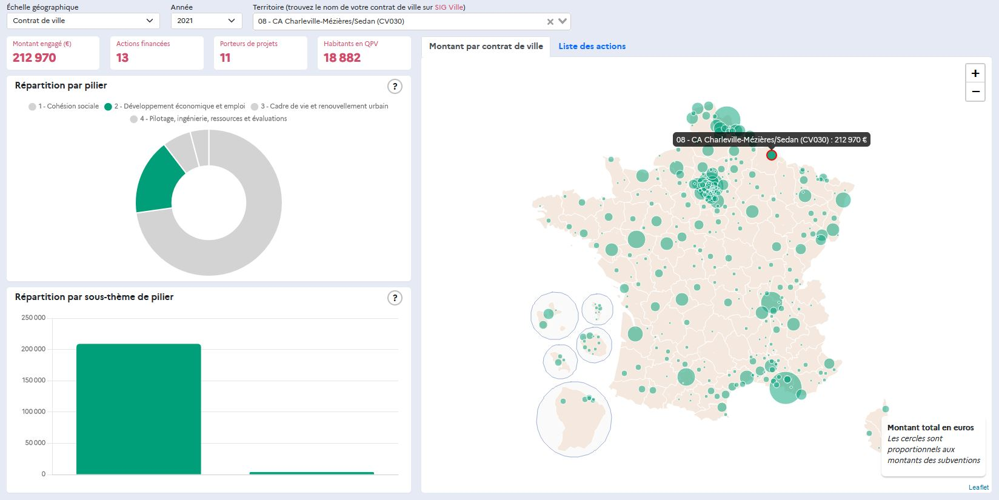

# Ci-VILLE 
(Cartes interactives de la politique de la ville)



Panorama interactif de la répartition par thème et par territoire des subventions politique de la ville financées par l'État depuis 2020.

[Page officielle](https://acteurs.lagrandeequipe.fr/article/74845)

[Lien direct](https://carto.pages.sit.incubateur.tech/vie-associative/)

## Données

Les données source sont issues de la plateforme collaborative de la politique de la ville Dauphin. Elles sont diffusées sous Licence ouverte 2.0 sur [data.gouv.fr](https://www.data.gouv.fr/fr/datasets/subventions-politique-de-la-ville/).

## Technologies

Cet outil, conçu et développé par le service cartographie de l'ANCT, a été réalisé à l'aide du framework Vue.js 3.x et de ses extensions VueX et Vue-router. Il utilise les librairies Leaflet.js, Chart.js, Bootstrap, Gsap

## En savoir plus sur les subventions politique de la ville : 

Sur le site ANCT : [https://agence-cohesion-territoires.gouv.fr/subventions-de-la-politique-de-la-ville-101](https://agence-cohesion-territoires.gouv.fr/subventions-de-la-politique-de-la-ville-101)

## Clone project
```
git clone https://www.github.com/anct-carto/ci-ville.git
```

## Project setup
```
npm install
```

### Compiles and hot-reloads for development
```
npm run serve
```

### Compiles and minifies for production
```
npm run build
```

### Lints and fixes files
```
npm run lint
```

### Customize configuration
See [Configuration Reference](https://cli.vuejs.org/config/).
